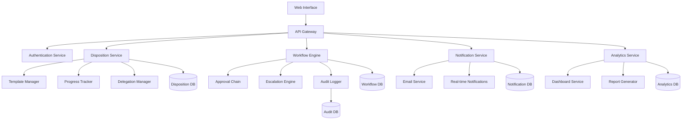
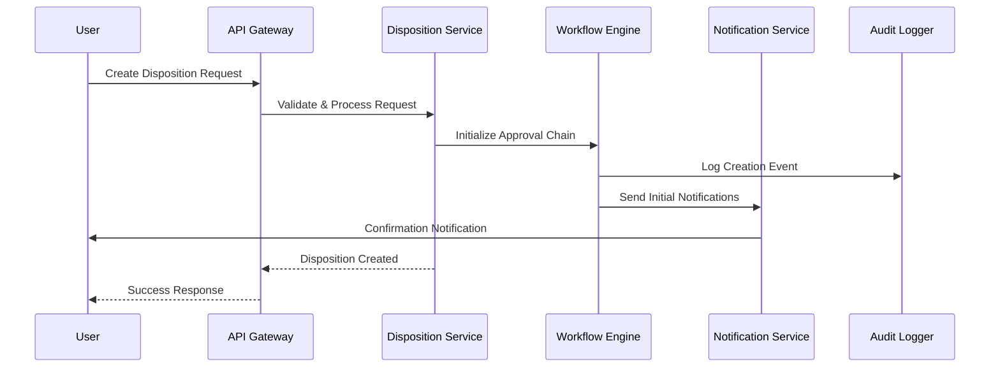
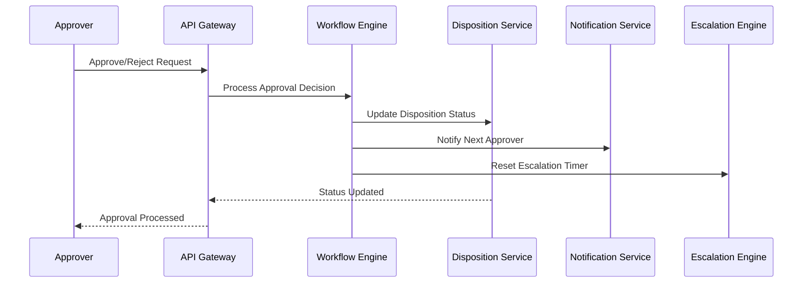

# Design Document: Penyempurnaan Sistem Disposisi

## Overview

Penyempurnaan sistem disposisi bertujuan untuk mengubah sistem disposisi yang ada menjadi sistem yang benar-benar mencerminkan workflow pemerintahan yang efisien. Sistem yang diperbaharui akan menambahkan fitur-fitur kritis seperti sistem persetujuan bertingkat, template disposisi dinamis, sistem delegasi, tracking progress real-time, sistem eskalasi otomatis, dan audit trail yang komprehensif. Sistem ini akan menghapus kompleksitas yang tidak perlu sambil meningkatkan akuntabilitas, transparansi, dan efisiensi dalam pengelolaan disposisi surat.

Arsitektur baru akan menggunakan pendekatan modular dengan separation of concerns yang jelas, memungkinkan scalability dan maintainability yang lebih baik. Sistem akan mengintegrasikan workflow engine untuk mengelola approval chain, notification system untuk real-time updates, dan analytics engine untuk monitoring dan reporting yang lebih canggih.

## Architecture



## Sequence Diagrams

### Main Disposition Creation Flow



### Approval Chain Flow



## Components and Interfaces

### Component 1: Disposition Service

**Purpose**: Core service untuk mengelola lifecycle disposisi dengan fitur enhanced tracking dan delegation

**Interface**:
```pascal
interface DispositionService {
  createDisposition(request: CreateDispositionRequest): DispositionResult
  updateProgress(dispositionId: UUID, progress: ProgressUpdate): Result
  delegateDisposition(dispositionId: UUID, delegation: DelegationRequest): Result
  getDispositionHistory(dispositionId: UUID): HistoryResult
  classifyAndRoute(suratMasuk: SuratMasuk): RoutingResult
}
```

**Responsibilities**:
- Mengelola CRUD operations untuk disposisi
- Mengintegrasikan dengan template manager untuk instruksi standar
- Mengelola delegation chain dan progress tracking
- Mengklasifikasi surat masuk untuk auto-routing

### Component 2: Workflow Engine

**Purpose**: Mengelola approval chain, escalation, dan business rules untuk disposisi

**Interface**:
```pascal
interface WorkflowEngine {
  initializeApprovalChain(disposition: Disposition): ApprovalChain
  processApproval(approvalId: UUID, decision: ApprovalDecision): WorkflowResult
  checkEscalationRules(disposition: Disposition): EscalationAction
  executeEscalation(dispositionId: UUID, action: EscalationAction): Result
}
```

**Responsibilities**:
- Mengelola approval chain berdasarkan hierarchy dan rules
- Mengeksekusi escalation otomatis berdasarkan deadline
- Menjalankan business rules dan validasi workflow
- Mengintegrasikan dengan audit logger untuk compliance

### Component 3: Template Manager

**Purpose**: Mengelola template disposisi dinamis berdasarkan jenis surat dan konteks

**Interface**:
```pascal
interface TemplateManager {
  getTemplateForSurat(suratType: SuratType, context: Context): Template
  createDynamicTemplate(criteria: TemplateCriteria): Template
  updateTemplate(templateId: UUID, updates: TemplateUpdate): Result
  validateTemplate(template: Template): ValidationResult
}
```

**Responsibilities**:
- Menyediakan template instruksi berdasarkan jenis surat
- Mendukung dynamic template generation dengan AI/ML
- Mengelola versioning dan approval untuk template changes
- Mengintegrasikan dengan classification system

### Component 4: Notification Service

**Purpose**: Mengelola notifikasi real-time dan scheduled notifications untuk semua stakeholder

**Interface**:
```pascal
interface NotificationService {
  sendRealTimeNotification(userId: UUID, notification: Notification): Result
  scheduleReminder(dispositionId: UUID, reminder: ReminderConfig): Result
  sendEscalationAlert(escalation: EscalationEvent): Result
  getNotificationPreferences(userId: UUID): NotificationPreferences
}
```

**Responsibilities**:
- Mengirim notifikasi real-time via WebSocket
- Mengelola email notifications dan reminders
- Menghandle escalation alerts dan urgent notifications
- Mengelola user preferences untuk notification channels

## Data Models

### Model 1: Enhanced Disposition

```pascal
interface EnhancedDisposition {
  id: UUID
  suratMasukId: UUID
  createdBy: UUID
  currentAssignee: UUID
  approvalChainId: UUID
  templateId: UUID
  status: DispositionStatus
  priority: Priority
  deadline: DateTime
  createdAt: DateTime
  updatedAt: DateTime
  
  // New fields for enhanced functionality
  progressPercentage: Integer
  currentStage: WorkflowStage
  escalationLevel: Integer
  delegationChain: Array<Delegation>
  feedbackRequired: Boolean
  classificationTags: Array<String>
}
```

**Validation Rules**:
- ID harus unique dan non-null
- Priority harus dalam range URGENT, HIGH, MEDIUM, LOW
- Progress percentage harus antara 0-100
- Deadline tidak boleh di masa lalu untuk disposisi baru
- Delegation chain tidak boleh circular

### Model 2: Approval Chain

```pascal
interface ApprovalChain {
  id: UUID
  dispositionId: UUID
  stages: Array<ApprovalStage>
  currentStageIndex: Integer
  isCompleted: Boolean
  createdAt: DateTime
  completedAt: DateTime?
}

interface ApprovalStage {
  id: UUID
  stageOrder: Integer
  approverRole: Role
  approverUserId: UUID?
  requiredApprovals: Integer
  currentApprovals: Integer
  status: StageStatus
  deadline: DateTime
  approvals: Array<Approval>
}
```

**Validation Rules**:
- Stage order harus sequential dan unique dalam chain
- Required approvals harus >= 1
- Current approvals tidak boleh > required approvals
- Deadline setiap stage harus sebelum deadline disposisi

### Model 3: Progress Tracking

```pascal
interface ProgressUpdate {
  id: UUID
  dispositionId: UUID
  updatedBy: UUID
  progressPercentage: Integer
  statusMessage: String
  attachments: Array<Attachment>
  timestamp: DateTime
  milestones: Array<Milestone>
}

interface Milestone {
  id: UUID
  name: String
  description: String
  targetDate: DateTime
  completedDate: DateTime?
  status: MilestoneStatus
}
```

**Validation Rules**:
- Progress percentage harus monotonic increasing
- Status message tidak boleh kosong
- Milestone target date harus realistic berdasarkan deadline
- Attachments harus valid file types dan size limits

## Algorithmic Pseudocode

### Main Disposition Creation Algorithm

```pascal
ALGORITHM createEnhancedDisposition(request)
INPUT: request of type CreateDispositionRequest
OUTPUT: result of type DispositionResult

BEGIN
  ASSERT validateCreateRequest(request) = true
  
  // Step 1: Initialize disposition with enhanced fields
  disposition ← createDispositionEntity(request)
  disposition.status ← PENDING_APPROVAL
  disposition.progressPercentage ← 0
  
  // Step 2: Auto-classify and determine routing
  classification ← classifyDocument(request.suratMasuk)
  template ← getTemplateForClassification(classification)
  disposition.templateId ← template.id
  disposition.classificationTags ← classification.tags
  
  // Step 3: Initialize approval chain based on classification and priority
  approvalChain ← buildApprovalChain(classification, request.priority)
  disposition.approvalChainId ← approvalChain.id
  
  // Step 4: Set up escalation rules
  escalationRules ← getEscalationRules(classification, request.priority)
  scheduleEscalationChecks(disposition.id, escalationRules)
  
  // Step 5: Save and trigger notifications
  savedDisposition ← repository.save(disposition)
  
  // Step 6: Send initial notifications
  notifyApprovalChain(approvalChain)
  notifyCreator(request.createdBy, savedDisposition)
  
  // Step 7: Log audit trail
  auditLogger.logCreation(savedDisposition, request.createdBy)
  
  ASSERT savedDisposition.id ≠ null
  ASSERT savedDisposition.status = PENDING_APPROVAL
  
  RETURN DispositionResult.success(savedDisposition)
END
```

**Preconditions:**
- request is validated and well-formed
- request.suratMasuk exists and is accessible
- request.createdBy has permission to create dispositions
- All required services (classification, template, approval) are available

**Postconditions:**
- Disposition is created with valid ID and PENDING_APPROVAL status
- Approval chain is initialized with correct stages and approvers
- Initial notifications are sent to relevant stakeholders
- Audit trail entry is created
- Escalation checks are scheduled

**Loop Invariants:**
- All created entities maintain referential integrity
- Notification queue remains consistent throughout process

### Approval Processing Algorithm

```pascal
ALGORITHM processApproval(approvalRequest)
INPUT: approvalRequest of type ApprovalRequest
OUTPUT: result of type ApprovalResult

BEGIN
  ASSERT validateApprovalRequest(approvalRequest) = true
  
  // Step 1: Get current approval chain state
  disposition ← getDisposition(approvalRequest.dispositionId)
  approvalChain ← getApprovalChain(disposition.approvalChainId)
  currentStage ← getCurrentStage(approvalChain)
  
  ASSERT currentStage ≠ null AND currentStage.status = PENDING
  
  // Step 2: Process the approval decision
  approval ← createApproval(approvalRequest)
  currentStage.approvals.add(approval)
  currentStage.currentApprovals ← currentStage.currentApprovals + 1
  
  // Step 3: Check if stage is complete
  IF currentStage.currentApprovals ≥ currentStage.requiredApprovals THEN
    currentStage.status ← APPROVED
    
    // Step 4: Move to next stage or complete
    IF hasNextStage(approvalChain, currentStage) THEN
      nextStage ← getNextStage(approvalChain, currentStage)
      nextStage.status ← PENDING
      approvalChain.currentStageIndex ← approvalChain.currentStageIndex + 1
      
      // Notify next stage approvers
      notifyStageApprovers(nextStage)
    ELSE
      // All stages completed
      approvalChain.isCompleted ← true
      approvalChain.completedAt ← now()
      disposition.status ← APPROVED
      
      // Notify final approval
      notifyFinalApproval(disposition)
    END IF
  END IF
  
  // Step 5: Handle rejection
  IF approvalRequest.decision = REJECTED THEN
    currentStage.status ← REJECTED
    approvalChain.isCompleted ← true
    disposition.status ← REJECTED
    
    notifyRejection(disposition, approvalRequest.reason)
  END IF
  
  // Step 6: Update and log
  repository.save(disposition)
  repository.save(approvalChain)
  auditLogger.logApproval(approval, approvalRequest.approverId)
  
  ASSERT disposition.status ∈ {PENDING_APPROVAL, APPROVED, REJECTED}
  
  RETURN ApprovalResult.success(disposition)
END
```

**Preconditions:**
- approvalRequest is validated with valid dispositionId and approverId
- Approver has permission to approve current stage
- Current stage is in PENDING status
- Approval chain exists and is not completed

**Postconditions:**
- Approval is recorded with timestamp and approver information
- Stage status is updated based on approval count and decision
- If stage complete, either next stage is activated or disposition is finalized
- All relevant stakeholders are notified of status change
- Audit trail is updated with approval action

**Loop Invariants:**
- Approval chain integrity is maintained throughout processing
- Stage order and approval counts remain consistent

### Escalation Processing Algorithm

```pascal
ALGORITHM processEscalation(dispositionId)
INPUT: dispositionId of type UUID
OUTPUT: result of type EscalationResult

BEGIN
  ASSERT dispositionId ≠ null
  
  // Step 1: Get disposition and check escalation conditions
  disposition ← getDisposition(dispositionId)
  escalationRules ← getEscalationRules(disposition)
  
  ASSERT disposition ≠ null AND escalationRules ≠ null
  
  // Step 2: Evaluate escalation triggers
  FOR each rule IN escalationRules DO
    ASSERT rule.isValid() = true
    
    IF evaluateEscalationCondition(disposition, rule) THEN
      // Step 3: Execute escalation action
      escalationAction ← determineEscalationAction(rule, disposition)
      
      CASE escalationAction.type OF
        NOTIFY_SUPERVISOR:
          supervisor ← getSupervisor(disposition.currentAssignee)
          sendEscalationNotification(supervisor, disposition, rule)
          
        REASSIGN_TO_MANAGER:
          manager ← getManager(disposition.currentAssignee)
          reassignDisposition(disposition, manager)
          notifyReassignment(disposition, manager)
          
        ESCALATE_TO_DIRECTOR:
          director ← getDirector(disposition.department)
          escalateToLevel(disposition, director, DIRECTOR_LEVEL)
          notifyHighLevelEscalation(director, disposition)
          
        AUTO_APPROVE:
          IF rule.allowAutoApprove = true THEN
            autoApproveDisposition(disposition, rule.reason)
            notifyAutoApproval(disposition)
          END IF
      END CASE
      
      // Step 4: Update escalation level and log
      disposition.escalationLevel ← disposition.escalationLevel + 1
      disposition.updatedAt ← now()
      
      // Step 5: Schedule next escalation check if needed
      IF hasNextEscalationLevel(rule) THEN
        nextRule ← getNextEscalationRule(rule)
        scheduleEscalationCheck(dispositionId, nextRule.triggerDelay)
      END IF
      
      auditLogger.logEscalation(disposition, escalationAction, rule)
      
      RETURN EscalationResult.success(escalationAction)
    END IF
  END FOR
  
  // No escalation needed
  RETURN EscalationResult.noAction()
END
```

**Preconditions:**
- dispositionId exists and references valid disposition
- Escalation rules are configured for disposition type/priority
- Required user hierarchy data (supervisors, managers) is available
- Escalation service has necessary permissions for actions

**Postconditions:**
- If escalation triggered, appropriate action is executed
- Disposition escalation level is incremented
- Relevant stakeholders are notified of escalation
- Next escalation check is scheduled if applicable
- Audit trail records escalation action and reasoning

**Loop Invariants:**
- Escalation rules are evaluated in priority order
- Disposition state remains consistent during rule evaluation
- Only one escalation action is executed per processing cycle

## Key Functions with Formal Specifications

### Function 1: classifyAndRoute()

```pascal
function classifyAndRoute(suratMasuk: SuratMasuk): RoutingResult
```

**Preconditions:**
- `suratMasuk` is non-null and contains valid document data
- `suratMasuk.content` is readable and contains text
- Classification service is available and trained

**Postconditions:**
- Returns valid RoutingResult with classification and routing recommendations
- If successful: `result.classification` contains document type and priority
- If successful: `result.recommendedAssignees` contains ranked list of suitable assignees
- Classification confidence score is between 0.0 and 1.0

**Loop Invariants:** N/A (no loops in main function)

### Function 2: validateApprovalChain()

```pascal
function validateApprovalChain(chain: ApprovalChain): ValidationResult
```

**Preconditions:**
- `chain` is defined and contains stages array
- Each stage has valid approver information

**Postconditions:**
- Returns boolean indicating chain validity
- `true` if and only if chain has no circular dependencies and valid stage order
- All validation errors are captured in result.errors array

**Loop Invariants:**
- For validation loops: All previously validated stages remain valid
- Stage order sequence remains monotonic increasing

### Function 3: calculateProgressPercentage()

```pascal
function calculateProgressPercentage(disposition: Disposition): Integer
```

**Preconditions:**
- `disposition` has valid approval chain and milestones
- All milestone data is consistent and up-to-date

**Postconditions:**
- Returns integer between 0 and 100 representing completion percentage
- Calculation considers both approval progress and milestone completion
- Result is deterministic for same input state

**Loop Invariants:**
- Progress calculation remains consistent across all milestones
- Weighted averages maintain mathematical correctness

## Example Usage

```pascal
// Example 1: Creating enhanced disposition with auto-classification
suratMasuk ← getSuratMasuk("SURAT-2024-001")
request ← CreateDispositionRequest{
  suratMasukId: suratMasuk.id,
  createdBy: currentUser.id,
  priority: HIGH,
  deadline: addDays(now(), 7),
  requiresFeedback: true
}

result ← dispositionService.createDisposition(request)

IF result.isSuccess() THEN
  disposition ← result.getData()
  displaySuccess("Disposisi berhasil dibuat dengan ID: " + disposition.id)
ELSE
  displayError("Gagal membuat disposisi: " + result.getError())
END IF

// Example 2: Processing approval with delegation
approvalRequest ← ApprovalRequest{
  dispositionId: "DISP-2024-001",
  approverId: currentUser.id,
  decision: APPROVED,
  comments: "Disetujui dengan catatan revisi minor",
  delegation: DelegationInfo{
    delegateTo: "USER-STAFF-001",
    reason: "Expertise in technical matters"
  }
}

approvalResult ← workflowEngine.processApproval(approvalRequest)

// Example 3: Real-time progress tracking
progressUpdate ← ProgressUpdate{
  dispositionId: "DISP-2024-001",
  updatedBy: currentUser.id,
  progressPercentage: 75,
  statusMessage: "Dokumen telah direview, menunggu final approval",
  milestones: [
    Milestone{name: "Initial Review", status: COMPLETED},
    Milestone{name: "Technical Analysis", status: COMPLETED},
    Milestone{name: "Final Approval", status: IN_PROGRESS}
  ]
}

updateResult ← dispositionService.updateProgress("DISP-2024-001", progressUpdate)

// Example 4: Handling escalation
escalationResult ← workflowEngine.checkEscalationRules("DISP-2024-001")
IF escalationResult.requiresAction() THEN
  action ← escalationResult.getAction()
  workflowEngine.executeEscalation("DISP-2024-001", action)
END IF
```

## Correctness Properties

*A property is a characteristic or behavior that should hold true across all valid executions of a system-essentially, a formal statement about what the system should do. Properties serve as the bridge between human-readable specifications and machine-verifiable correctness guarantees.*

### Property 1: Approval Chain Integrity

*For any* disposition and its associated approval chain, the chain must be valid and contain no circular dependencies

**Validates: Requirements 2.1, 1.4**

### Property 2: Progress Monotonicity

*For any* disposition and its progress updates, the progress percentage must be monotonically increasing over time

**Validates: Requirement 1.3**

### Property 3: Escalation Consistency

*For any* disposition that is overdue and not completed, there must exist a corresponding escalation action

**Validates: Requirement 2.3**

### Property 4: Audit Trail Completeness

*For any* system action performed, there must exist a corresponding audit trail entry with matching timestamp and action details

**Validates: Requirements 6.1, 2.5**

### Property 5: Notification Delivery

*For any* notifiable event in the system, there must exist a corresponding notification that has been sent or delivered

**Validates: Requirements 4.1, 4.2, 4.3, 4.4**

### Property 6: Classification Consistency

*For any* document with identical content, the classification system must produce consistent results with stable confidence scores

**Validates: Requirements 11.1, 11.2**

### Property 7: Template Selection Accuracy

*For any* document classification, the template manager must select an appropriate template that matches the document type and context

**Validates: Requirements 3.1, 3.5**

### Property 8: Delegation Acyclicity

*For any* delegation chain, there must be no circular delegations that would create infinite loops

**Validates: Requirement 1.4**

### Property 9: Authorization Enforcement

*For any* user attempting to access sensitive data, the system must validate authorization according to role-based access control rules

**Validates: Requirement 6.3**

### Property 10: Data Encryption Compliance

*For any* sensitive data operation, the system must apply encryption both at rest and in transit using industry standards

**Validates: Requirement 6.4**

### Property 11: Performance Response Time

*For any* disposition creation request, the system must respond within the specified time limits (500ms for creation, 200ms for approval, 100ms for notifications)

**Validates: Requirements 7.1, 7.2, 7.3**

### Property 12: Backup Integrity

*For any* backup operation, the system must verify data integrity and store backups in multiple locations according to retention policies

**Validates: Requirements 10.1, 10.2, 10.5**

### Property 13: Export-Import Round Trip

*For any* data exported in standard formats (JSON, CSV, PDF), importing the same data must preserve referential integrity and produce equivalent objects

**Validates: Requirements 8.2, 8.3**

### Property 14: Offline-Online Synchronization

*For any* data modified in offline mode, synchronization upon reconnection must preserve data integrity and resolve conflicts appropriately

**Validates: Requirements 12.2, 12.3**

### Property 15: Search Result Accuracy

*For any* search query, the system must return accurate and complete results that match the search criteria and user's access permissions

**Validates: Requirements 9.2, 9.1**

## Error Handling

### Error Scenario 1: Approval Chain Validation Failure

**Condition**: When creating or modifying approval chain with invalid configuration
**Response**: System validates chain integrity and returns detailed validation errors
**Recovery**: User must fix chain configuration before proceeding; system suggests valid alternatives

### Error Scenario 2: Escalation Service Unavailable

**Condition**: When escalation engine cannot process due to service failure
**Response**: System logs error, queues escalation for retry, and sends fallback notification
**Recovery**: Automatic retry with exponential backoff; manual escalation option for critical items

### Error Scenario 3: Template Generation Failure

**Condition**: When dynamic template cannot be generated for document classification
**Response**: System falls back to default template and logs classification failure
**Recovery**: Manual template selection option; system learns from user corrections

### Error Scenario 4: Notification Delivery Failure

**Condition**: When email or real-time notifications cannot be delivered
**Response**: System retries with different channels and logs delivery attempts
**Recovery**: Alternative notification methods (SMS, in-app); escalation to supervisor if critical

### Error Scenario 5: Circular Delegation Detection

**Condition**: When delegation would create circular assignment chain
**Response**: System prevents delegation and shows delegation chain visualization
**Recovery**: User must select different delegate; system suggests valid alternatives

## Testing Strategy

### Unit Testing Approach

Setiap komponen akan memiliki comprehensive unit tests dengan fokus pada:
- Business logic validation untuk approval chains dan escalation rules
- Data transformation accuracy untuk classification dan routing
- Error handling robustness untuk all failure scenarios
- Performance testing untuk large-scale operations

Target coverage: 90% code coverage dengan emphasis pada critical paths dan edge cases.

### Property-Based Testing Approach

**Property Test Library**: fast-check (JavaScript/TypeScript)

**Key Properties to Test**:
1. **Approval Chain Properties**: Generated approval chains always maintain valid stage ordering and no circular dependencies
2. **Progress Tracking Properties**: Progress updates always result in monotonic increasing percentages
3. **Escalation Properties**: Escalation rules always trigger within specified time bounds for overdue dispositions
4. **Classification Properties**: Document classification always produces consistent results for identical inputs
5. **Delegation Properties**: Delegation chains never create cycles and maintain proper authorization hierarchy

**Example Property Tests**:
```pascal
PROPERTY approvalChainIntegrity(chain: ApprovalChain):
  REQUIRE: chain.stages.length > 0
  ENSURE: isValidStageOrder(chain.stages) AND hasNoCircularDeps(chain)

PROPERTY progressMonotonicity(updates: Array<ProgressUpdate>):
  REQUIRE: updates.length > 1 AND allSameDisposition(updates)
  ENSURE: isMonotonicIncreasing(updates.map(u => u.progressPercentage))
```

### Integration Testing Approach

Integration tests akan fokus pada:
- End-to-end workflow testing dari creation hingga completion
- Cross-service communication testing antara disposition, workflow, dan notification services
- Database transaction integrity testing untuk complex operations
- Real-time notification delivery testing dengan WebSocket connections

## Performance Considerations

**Database Optimization**:
- Indexing pada foreign keys dan frequently queried fields (status, deadline, assignee)
- Partitioning untuk audit trail berdasarkan tanggal
- Connection pooling untuk high-concurrency scenarios

**Caching Strategy**:
- Redis caching untuk frequently accessed templates dan user hierarchy data
- Application-level caching untuk classification models dan routing rules
- CDN caching untuk static assets dan document previews

**Scalability Measures**:
- Horizontal scaling untuk notification service dengan message queues
- Microservice architecture untuk independent scaling of components
- Async processing untuk non-critical operations (analytics, reporting)

**Performance Targets**:
- Disposition creation: < 500ms response time
- Approval processing: < 200ms response time
- Real-time notifications: < 100ms delivery time
- Dashboard loading: < 2s for 1000+ dispositions

## Security Considerations

**Authentication & Authorization**:
- JWT-based authentication dengan refresh token rotation
- Role-based access control (RBAC) dengan fine-grained permissions
- Multi-factor authentication untuk sensitive operations

**Data Protection**:
- Encryption at rest untuk sensitive document content
- TLS 1.3 untuk all network communications
- Data anonymization untuk analytics dan reporting

**Audit & Compliance**:
- Comprehensive audit logging untuk all user actions
- Immutable audit trail dengan cryptographic integrity
- GDPR compliance untuk personal data handling
- Regular security assessments dan penetration testing

**Input Validation**:
- Server-side validation untuk all user inputs
- SQL injection prevention dengan parameterized queries
- XSS prevention dengan content security policies
- File upload validation dengan virus scanning

## Dependencies

**Core Framework Dependencies**:
- Flask/FastAPI untuk web framework
- SQLAlchemy untuk database ORM
- Celery untuk async task processing
- Redis untuk caching dan message queuing

**External Services**:
- Email service (SendGrid/AWS SES) untuk notifications
- Document classification service (custom ML model atau cloud API)
- File storage service (AWS S3/MinIO) untuk attachments
- Monitoring service (Prometheus/Grafana) untuk observability

**Database Requirements**:
- PostgreSQL 13+ untuk main database dengan JSON support
- Redis 6+ untuk caching dan session storage
- Elasticsearch untuk full-text search capabilities

**Infrastructure Dependencies**:
- Docker untuk containerization
- Kubernetes untuk orchestration (production)
- nginx untuk reverse proxy dan load balancing
- SSL certificates untuk HTTPS termination